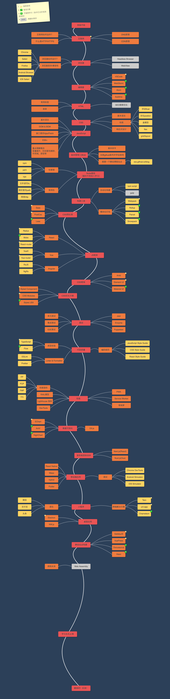

# Front End Roadmap 🧶🦌

一个帮助新手、初级、中级前端开发者不断精进学习的网站，前端学习路上，不再迷茫~

🚀 [访问路线](https://objtube.github.io/front-end-roadmap/#/)

📺 [Up主视频讲解前端学习路线](https://www.bilibili.com/video/BV1ZZ4y1H7rU/)


## 功能

1. 点击卡片可以进入到具体的页面，查看学习资料  
2. 提供路线图下载的功能  
3. 路线根据学习阶段进行了分级，可以查看每个阶段应该掌握的技术点  
4. 可以关闭标签的标注（标注来着个人的看法，如不喜欢可以关掉） 

## 贡献指南

方法一：

* 点击右上角`fork`按钮，将项目`fork`到自己的Github账户里。

* 使用`git clone`将项目克隆到本地。

``` bash
git clone https://github.com/ObjTube/front-end-roadmap
```

* 用编辑器打开进行贡献，然后提交到`fork`的仓库。

``` bash
code .
git add .
git commit -m "What did I do?"
git push origin master
```

* 提交`Pull request`


方式二：

* 在每个条目页面下方点击 `想要补充，点击这里📝` 的链接，将跳转到Github的文件编辑界面，即可在线编辑，之后再提交`Pull request`

方法三：

[](https://gitpod.io/#https://github.com/ObjTube/front-end-roadmap)


欢迎大家贡献学习资源 :heart:

## 预览




